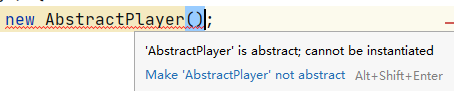
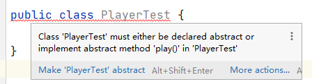
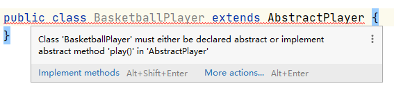

## 抽象类


### 01、抽象类的 5 个关键点

1）定义抽象类的时候需要用到关键字 `abstract`，放在 `class` 关键字前。

```java
public abstract class AbstractPlayer {
}
```

关于抽象类的命名，阿里出品的 Java 开发手册上有强调，“抽象类命名要使用 Abstract 或 Base 开头”，记住了哦。

2）抽象类不能被实例化，但可以有子类。

尝试通过 `new` 关键字实例化的话，编译器会报错，提示“类是抽象的，不能实例化”。



通过 `extends` 关键字可以继承抽象类，继承后，BasketballPlayer 类就是 AbstractPlayer 的子类。

```java
public class BasketballPlayer extends AbstractPlayer {
}
```

3）如果一个类定义了一个或多个抽象方法，那么这个类必须是抽象类。

当在一个普通类（没有使用 `abstract` 关键字修饰）中定义了抽象方法，编译器就会有两处错误提示。

第一处在类级别上，提醒你“这个类必须通过 `abstract` 关键字定义”，or 的那个信息没必要，见下图。



第二处在方法级别上，提醒你“抽象方法所在的类不是抽象的”，见下图。


4）抽象类可以同时声明抽象方法和具体方法，也可以什么方法都没有，但没必要。就像下面这样：

```java
public abstract class AbstractPlayer {
    abstract void play();
    
    public void sleep() {
        System.out.println("运动员也要休息而不是挑战极限");
    }
}
```

5）抽象类派生的子类必须实现父类中定义的抽象方法。比如说，抽象类中定义了 `play()` 方法，子类中就必须实现。

```java
public class BasketballPlayer extends AbstractPlayer {
    @Override
    void play() {
        System.out.println("我是张伯伦，篮球场上得过 100 分");
    }
}
```

如果没有实现的话，编译器会提醒你“子类必须实现抽象方法”，见下图。



### 02、什么时候用抽象类

与抽象类息息相关的还有一个概念，就是接口，我们留到下一篇文章中详细说，因为要说的知识点还是蛮多的。你现在只需要有这样一个概念就好，接口是对行为的抽象，抽象类是对整个类（包含成员变量和行为）进行抽象。


除了接口之外，还有一个概念就是具体的类，就是不通过 `abstract` 修饰的普通类，见下面这段代码中的定义。

```java
public class BasketballPlayer {
   public void play() {
        System.out.println("我是詹姆斯，现役第一人");
    }
}
```

有接口，有具体类，那什么时候该使用抽象类呢？

1）我们希望一些通用的功能被多个子类复用。比如说，AbstractPlayer 抽象类中有一个普通的方法 `sleep()`，表明所有运动员都需要休息，那么这个方法就可以被子类复用。

```java
public abstract class AbstractPlayer {
    public void sleep() {
        System.out.println("运动员也要休息而不是挑战极限");
    }
}
```

虽然 AbstractPlayer 类可以不是抽象类——把 `abstract` 修饰符去掉也能满足这种场景。但 AbstractPlayer 类可能还会有一个或者多个抽象方法。

BasketballPlayer 继承了 AbstractPlayer 类，也就拥有了 `sleep()` 方法。

```java
public class BasketballPlayer extends AbstractPlayer {
}
```

BasketballPlayer 对象可以直接调用 `sleep()` 方法：

```java
BasketballPlayer basketballPlayer = new BasketballPlayer();
basketballPlayer.sleep();
```

FootballPlayer 继承了 AbstractPlayer 类，也就拥有了 `sleep()` 方法。

```java
public class FootballPlayer extends AbstractPlayer {
}
```

FootballPlayer 对象也可以直接调用 `sleep()` 方法：

```java
FootballPlayer footballPlayer = new FootballPlayer();
footballPlayer.sleep();
```

2）我们需要在抽象类中定义好 API，然后在子类中扩展实现。比如说，AbstractPlayer  抽象类中有一个抽象方法 `play()`，定义所有运动员都可以从事某项运动，但需要对应子类去扩展实现。

```java
public abstract class AbstractPlayer {
    abstract void play();
}
```

BasketballPlayer 继承了 AbstractPlayer 类，扩展实现了自己的 `play()` 方法。

```java
public class BasketballPlayer extends AbstractPlayer {
    @Override
    void play() {
        System.out.println("我是张伯伦，我篮球场上得过 100 分，");
    }
}
```

FootballPlayer 继承了 AbstractPlayer 类，扩展实现了自己的 `play()` 方法。

```java
public class FootballPlayer extends AbstractPlayer {
    @Override
    void play() {
        System.out.println("我是C罗，我能接住任意高度的头球");
    }
}
```

3）如果父类与子类之间的关系符合 `is-a` 的层次关系，就可以使用抽象类，比如说篮球运动员是运动员，足球运动员是运动员。

### 03、具体示例

为了进一步展示抽象类的特性，我们再来看一个具体的示例。假设现在有一个文件，里面的内容非常简单——“Hello World”，现在需要有一个读取器将内容读取出来，最好能按照大写的方式，或者小写的方式。

这时候，最好定义一个抽象类，比如说 BaseFileReader：

```java
public abstract class BaseFileReader {
    protected Path filePath;

    protected BaseFileReader(Path filePath) {
        this.filePath = filePath;
    }

    public List<String> readFile() throws IOException {
        return Files.lines(filePath)
                .map(this::mapFileLine).collect(Collectors.toList());
    }

    protected abstract String mapFileLine(String line);
}
```

filePath 为文件路径，使用 protected 修饰，表明该成员变量可以在需要时被子类访问。

`readFile()` 方法用来读取文件，方法体里面调用了抽象方法 `mapFileLine()`——需要子类扩展实现大小写的方式。

你看，BaseFileReader 设计的就非常合理，并且易于扩展，子类只需要专注于具体的大小写实现方式就可以了。

小写的方式：

```java
public class LowercaseFileReader extends BaseFileReader {
    protected LowercaseFileReader(Path filePath) {
        super(filePath);
    }

    @Override
    protected String mapFileLine(String line) {
        return line.toLowerCase();
    }
}
```

大写的方式：

```java
public class UppercaseFileReader extends BaseFileReader {
    protected UppercaseFileReader(Path filePath) {
        super(filePath);
    }

    @Override
    protected String mapFileLine(String line) {
        return line.toUpperCase();
    }
}
```

你看，从文件里面一行一行读取内容的代码被子类复用了——抽象类 BaseFileReader 类中定义的普通方法 `readFile()`。与此同时，子类只需要专注于自己该做的工作，LowercaseFileReader 以小写的方式读取文件内容，UppercaseFileReader 以大写的方式读取文件内容。

接下来，我们来新建一个测试类 FileReaderTest：

```java
public class FileReaderTest {
    public static void main(String[] args) throws URISyntaxException, IOException {
        URL location = FileReaderTest.class.getClassLoader().getResource("helloworld.txt");
        Path path = Paths.get(location.toURI());
        BaseFileReader lowercaseFileReader = new LowercaseFileReader(path);
        BaseFileReader uppercaseFileReader = new UppercaseFileReader(path);
        System.out.println(lowercaseFileReader.readFile());
        System.out.println(uppercaseFileReader.readFile());
    }
}
```

项目的 resource 目录下有一个文本文件，名字叫 helloworld.txt。


可以通过 `ClassLoader.getResource()` 的方式获取到该文件的 URI 路径，然后就可以使用 LowercaseFileReader 和 UppercaseFileReader 两种方式读取到文本内容了。

输出结果如下所示：

```
[hello world]
[HELLO WORLD]
```

