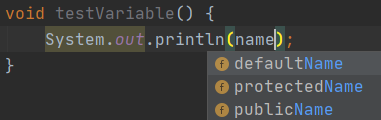
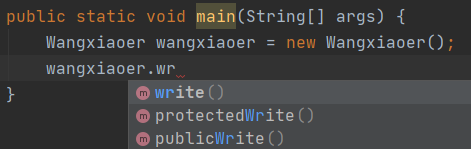
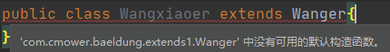
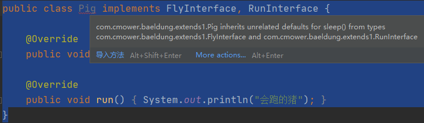

## 继承

在 Java 中，一个类可以继承另外一个类或者实现多个接口。还有一点，就是一个接口也可以继承另外一个接口，就像下面这样：

```java
public interface OneInterface extends Cloneable {
}
```

这样做有什么好处呢？就是实现了 OneInterface 接口的类，也可以使用 `Object.clone()` 方法了。

```java
public class TestInterface implements OneInterface {
    public static void main(String[] args) throws CloneNotSupportedException {
        TestInterface c1 = new TestInterface();
        TestInterface c2 = (TestInterface) c1.clone();
    }
}
```

除此之外，我们还可以在 OneInterface 接口中定义其他一些抽象方法（比如说深拷贝），使该接口拥有 Cloneable 所不具有的功能。

```java
public interface OneInterface extends Cloneable {
    void deepClone();
}
```

看到了吧？这就是继承的好处：**子接口拥有了父接口的方法，使得子接口具有了父接口相同的行为；同时，子接口还可以在此基础上自由发挥，添加属于自己的行为**。

以上，把“接口”换成“类”，结论同样成立。让我们来定义一个普通的父类 Wanger：

```java
public class Wanger {
    int age;
    String name;
    void write() {
        System.out.println("我写了本《基督山伯爵》");
    }
}
```

然后，我们再来定义一个子类 Wangxiaoer，使用关键字 `extends` 来继承父类 Wanger：

```java
public class Wangxiaoer extends Wanger{
    @Override
    void write() {
        System.out.println("我写了本《茶花女》");
    }
}
```

我们可以将通用的方法和成员变量放在父类中，达到代码复用的目的；然后将特殊的方法和成员变量放在子类中，除此之外，子类还可以覆盖父类的方法（比如`write()` 方法）。这样，子类也就焕发出了新的生命力。

Java 只支持单一继承，如果一个类在定义的时候没有使用 `extends` 关键字，那么它隐式地继承了 `java.lang.Object` 类——在我看来，这恐怕就是 Java 号称万物皆对象的真正原因了。

那究竟子类继承了父类的什么呢？

子类可以继承父类的非 private 成员变量，为了验证这一点，我们来看下面这个示例。

```java
public class Wanger {
    String defaultName;
    private String privateName;
    public String publicName;
    protected String protectedName;
}
```

父类 Wanger 定义了四种类型的成员变量，缺省的 defaultName、私有的 privateName、共有的 publicName、受保护的 protectedName。

在子类 Wangxiaoer 中定义一个测试方法 `testVariable()`：



可以确认，除了私有的 privateName，其他三种类型的成员变量都可以继承到。

同理，子类可以继承父类的非 private 方法，为了验证这一点，我们来看下面这个示例。

```java
public class Wanger {
    void write() {
    }

    private void privateWrite() {
    }

    public void publicWrite() {
    }

    protected void protectedWrite() {
    }
}
```

父类 Wanger 定义了四种类型的方法，缺省的 write、私有的 privateWrite()、共有的 publicWrite()、受保护的 protectedWrite()。

在子类 Wangxiaoer 中定义一个 main 方法，并使用 new 关键字新建一个子类对象：



可以确认，除了私有的 privateWrite()，其他三种类型的方法都可以继承到。

不过，子类无法继承父类的构造方法。如果父类的构造方法是带有参数的，代码如下所示：

```java
public class Wanger {
    int age;
    String name;

    public Wanger(int age, String name) {
        this.age = age;
        this.name = name;
    }
}
```

则必须在子类的构造器中显式地通过 super 关键字进行调用，否则编译器将提示以下错误：



修复后的代码如下所示：

```java
public class Wangxiaoer extends Wanger{
    public Wangxiaoer(int age, String name) {
        super(age, name);
    }
}
```

is-a 是继承的一个明显特征，就是说子类的对象引用类型可以是一个父类类型。

```java
public class Wangxiaoer extends Wanger{
    public static void main(String[] args) {
        Wanger wangxiaoer = new Wangxiaoer();
    }
}
```

同理，子接口的实现类的对象引用类型也可以是一个父接口类型。

```java
public interface OneInterface extends Cloneable {
}
public class TestInterface implements OneInterface {
    public static void main(String[] args) {
        Cloneable c1 = new TestInterface();
    }
}
```

尽管一个类只能继承一个类，但一个类却可以实现多个接口。另外，还有一点，就是 Java 8 之后，接口中可以定义 default 方法，这很方便，但也带来了新的问题：

>如果一个类实现了多个接口，而这些接口中定义了相同签名的 default 方法，那么这个类就要重写该方法，否则编译无法通过。

FlyInterface 是一个会飞的接口，里面有一个签名为 `sleep()` 的默认方法：

```java
public interface FlyInterface {
    void fly();
    default void sleep() {
        System.out.println("睡着飞");
    }
}
```

RunInterface 是一个会跑的接口，里面也有一个签名为 `sleep()` 的默认方法：

```java
public interface RunInterface {
    void run();
    default void sleep() {
        System.out.println("睡着跑");
    }
}
```

Pig 类实现了 FlyInterface 和 RunInterface 两个接口，但这时候编译出错了。



原本，default 方法就是为实现该接口而不覆盖该方法的类提供默认实现的，现在，相同方法签名的 `sleep()` 方法把编译器搞懵逼了，只能重写了。

```java
public class Pig implements FlyInterface, RunInterface {

    @Override
    public void fly() {
        System.out.println("会飞的猪");
    }

    @Override
    public void sleep() {
        System.out.println("只能重写了");
    }

    @Override
    public void run() {
        System.out.println("会跑的猪");
    }
}
```

类虽然不能继承多个类，但接口却可以继承多个接口，这一点，我不知道有没有触及到一些读者的知识盲区。

```java
public interface WalkInterface extends FlyInterface,RunInterface{
    void walk();
}
```